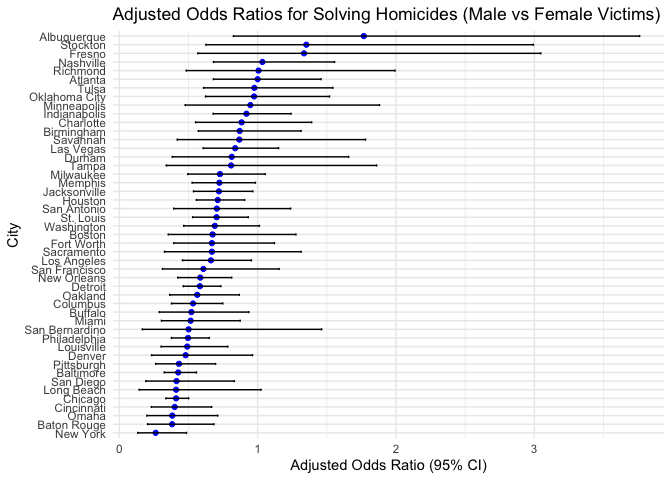

p8105_hw6_fl2715
================
Fengwei Lei

## Load Library and Set Seed

``` r
library(tidyverse)
library(p8105.datasets)
library(patchwork)
library(forcats)
library(modelr)
library(mgcv)
set.seed(1)
theme_set(theme_minimal() + theme(legend.position = "bottom"))
```

## Problem 1

First， we load the data.

``` r
weather_df = 
  rnoaa::meteo_pull_monitors(
    c("USW00094728"),
    var = c("PRCP", "TMIN", "TMAX"), 
    date_min = "2017-01-01",
    date_max = "2017-12-31")  |> 
  mutate(
    name = recode(id, USW00094728 = "CentralPark_NY"),
    tmin = tmin / 10,
    tmax = tmax / 10)  |> 
  select(name, id, everything())
```

After that, we take Bootstrap procedure with `modelr::bootstrap`.

``` r
boot_results = weather_df  |> 
  modelr::bootstrap(n = 5000)  |> 
  mutate(
    model = map(strap, \(df) lm(tmax ~ tmin, data = df)),  
    glance_results = map(model, broom::glance),           
    tidy_results = map(model, broom::tidy)                
  )


final_results = boot_results |> 
  mutate(
    r_squared = map_dbl(glance_results, "r.squared"),  
    tidy_df = map(tidy_results, \(df) df |> 
                    select(term, estimate) |>         
                    pivot_wider(names_from = term, values_from = estimate) |> 
                    mutate(log_beta = log(`(Intercept)`) + log(tmin))) 
  ) |> 
  select(-strap, -model, -glance_results, -tidy_results) |> 
  unnest(tidy_df)  
```

Then, using the results for bootstrap, we draw the distribution plots
for the estimates $`\hat{r}^2`$ and
$`log(\hat{\beta}_0 * \hat{\beta}_1)`$.

``` r
p1 = ggplot(final_results, aes(x = r_squared)) +
  geom_density(fill = "blue", alpha = 0.5) +
  labs(title = "Distribution of R^2", x = "R^2", y = "Density") +
  theme_minimal()

p2 = ggplot(final_results, aes(x = log_beta)) +
  geom_density(fill = "red", alpha = 0.5) +
  labs(title = "Distribution of log(beta0 * beta1)", x = "log(beta0 * beta1)", y = "Density") +
  theme_minimal()

p1 + p2
```

<!-- -->

**Description**:

From the above plots, we can see that these two estimates both nearly
follow the normal distribution. The left plot shows the distribution of
$`\hat{r}^2`$ , concentrated between 0.88 and 0.94 with a symmetric
unimodal shape. The right plot represents
$`log(\hat{\beta}_0 * \hat{\beta}_1)`$ , concentrated between 1.95 and
2.10, also symmetric and unimodal, reflecting precise and stable
estimates.

Using the 5000 bootstrap estimates, identify the 2.5% and 97.5%
quantiles to provide a 95% confidence interval for $`\hat{r}^2`$ and
$`log(\hat{\beta}_0 * \hat{\beta}_1)`$.

``` r
ci_results = final_results |> 
  reframe(
    r_squared_ci = quantile(r_squared, c(0.025, 0.975)),
    log_beta_ci = quantile(log_beta, c(0.025, 0.975))
  )

cat("95% Confidence Interval for R^2:", ci_results$r_squared_ci, "\n")
```

    ## 95% Confidence Interval for R^2: 0.8936684 0.927106

``` r
cat("95% Confidence Interval for log(beta0 * beta1):", ci_results$log_beta_ci, "\n")
```

    ## 95% Confidence Interval for log(beta0 * beta1): 1.964949 2.058887

## Problem 2

First, we load the data.

``` r
homicide_data = read_csv("data/homicide-data.csv") |>
  janitor::clean_names() |> 
  mutate(city_state = paste(city, state, sep = ", "),
         resolved = ifelse(disposition == "Closed by arrest", 1, 0),
         victim_race = str_to_lower(victim_race),
         victim_age_clean = as.numeric(gsub("[^0-9]", "", victim_age))) |> 
  filter(
    !city_state %in% c("Dallas, TX", "Phoenix, AZ", "Kansas City, MO", "Tulsa, AL"),
    victim_race %in% c("white", "black")
  ) |> 
  mutate(victim_age = victim_age_clean) |> 
  select(-victim_age_clean)  
```

    ## Rows: 52179 Columns: 12
    ## ── Column specification ────────────────────────────────────────────────────────
    ## Delimiter: ","
    ## chr (9): uid, victim_last, victim_first, victim_race, victim_age, victim_sex...
    ## dbl (3): reported_date, lat, lon
    ## 
    ## ℹ Use `spec()` to retrieve the full column specification for this data.
    ## ℹ Specify the column types or set `show_col_types = FALSE` to quiet this message.

Then, we run the logistic regression model. And we obtain the estimate
and confidence interval of the adjusted odds ratio for solving homicides
comparing male victims to female victims keeping all other variables
fixed.

``` r
baltimore_data = homicide_data |> 
  filter(city_state == "Baltimore, MD")

baltimore_model = glm(resolved ~ victim_age + victim_sex + victim_race, 
                       data = baltimore_data, family = binomial())

baltimore_results = broom::tidy(baltimore_model, conf.int = TRUE, exponentiate = TRUE)

baltimore_or = baltimore_results |> 
  filter(term == "victim_sexMale") |> 
  select(term, estimate, conf.low, conf.high) |> 
  rename(
    `Comparison` = term,
    `Adjusted Odds Ratio` = estimate,
    `Lower 95% CI` = conf.low,
    `Upper 95% CI` = conf.high
  )

baltimore_or |> 
  knitr::kable(caption = "Adjusted Odds Ratio for Male vs Female Victims (Baltimore)") 
```

| Comparison     | Adjusted Odds Ratio | Lower 95% CI | Upper 95% CI |
|:---------------|--------------------:|-------------:|-------------:|
| victim_sexMale |           0.4255117 |    0.3241908 |    0.5575508 |

Adjusted Odds Ratio for Male vs Female Victims (Baltimore)

After that, we run `glm` for each of the cities.

``` r
city_results = homicide_data |> 
  group_by(city) |> 
  nest() |> 
  mutate(
    models = map(data, \(df) glm(resolved ~ victim_age + victim_sex + victim_race, 
                             data = df, family = binomial())),
    tidy_results = map(models, \(model) broom::tidy(model, conf.int = TRUE, exponentiate = TRUE))
  ) |> 
  unnest(tidy_results) |> 
  filter(term == "victim_sexMale") |> 
  select(city, estimate, conf.low, conf.high) 

city_results |> 
  knitr::kable(
    col.names = c(
      "City", 
      "Adjusted Odds Ratio", 
      "Lower 95% CI", 
      "Upper 95% CI"
    ),
    caption = "Adjusted Odds Ratio for Male vs Female Victims by City"
  )
```

| City           | Adjusted Odds Ratio | Lower 95% CI | Upper 95% CI |
|:---------------|--------------------:|-------------:|-------------:|
| Albuquerque    |           1.7674995 |    0.8247081 |    3.7618600 |
| Atlanta        |           1.0000771 |    0.6803477 |    1.4582575 |
| Baltimore      |           0.4255117 |    0.3241908 |    0.5575508 |
| Baton Rouge    |           0.3814393 |    0.2043481 |    0.6836343 |
| Birmingham     |           0.8700153 |    0.5713814 |    1.3138409 |
| Boston         |           0.6739912 |    0.3534469 |    1.2768225 |
| Buffalo        |           0.5205704 |    0.2884416 |    0.9358300 |
| Charlotte      |           0.8838976 |    0.5507440 |    1.3905954 |
| Chicago        |           0.4100982 |    0.3361233 |    0.5008546 |
| Cincinnati     |           0.3998277 |    0.2313767 |    0.6670456 |
| Columbus       |           0.5324845 |    0.3770457 |    0.7479124 |
| Denver         |           0.4790620 |    0.2327380 |    0.9624974 |
| Detroit        |           0.5823472 |    0.4619454 |    0.7335458 |
| Durham         |           0.8123514 |    0.3824420 |    1.6580169 |
| Fort Worth     |           0.6689803 |    0.3935128 |    1.1211603 |
| Fresno         |           1.3351647 |    0.5672553 |    3.0475080 |
| Houston        |           0.7110264 |    0.5569844 |    0.9057376 |
| Indianapolis   |           0.9187284 |    0.6784616 |    1.2413059 |
| Jacksonville   |           0.7198144 |    0.5359236 |    0.9650986 |
| Las Vegas      |           0.8373078 |    0.6058830 |    1.1510854 |
| Long Beach     |           0.4102163 |    0.1427304 |    1.0241775 |
| Los Angeles    |           0.6618816 |    0.4565014 |    0.9541036 |
| Louisville     |           0.4905546 |    0.3014879 |    0.7836391 |
| Memphis        |           0.7232194 |    0.5261210 |    0.9835973 |
| Miami          |           0.5152379 |    0.3040214 |    0.8734480 |
| Milwaukee      |           0.7271327 |    0.4951325 |    1.0542297 |
| Minneapolis    |           0.9469587 |    0.4759016 |    1.8809745 |
| Nashville      |           1.0342379 |    0.6807452 |    1.5559966 |
| New Orleans    |           0.5849373 |    0.4218807 |    0.8121787 |
| New York       |           0.2623978 |    0.1327512 |    0.4850117 |
| Oakland        |           0.5630819 |    0.3637421 |    0.8671086 |
| Oklahoma City  |           0.9740747 |    0.6228507 |    1.5199721 |
| Omaha          |           0.3824861 |    0.1988357 |    0.7109316 |
| Philadelphia   |           0.4962756 |    0.3760120 |    0.6498797 |
| Pittsburgh     |           0.4307528 |    0.2626022 |    0.6955518 |
| Richmond       |           1.0060520 |    0.4834671 |    1.9936248 |
| San Antonio    |           0.7046200 |    0.3928179 |    1.2382509 |
| Sacramento     |           0.6688418 |    0.3262733 |    1.3143888 |
| Savannah       |           0.8669817 |    0.4185827 |    1.7802453 |
| San Bernardino |           0.5003444 |    0.1655367 |    1.4623977 |
| San Diego      |           0.4130248 |    0.1913527 |    0.8301847 |
| San Francisco  |           0.6075362 |    0.3116925 |    1.1551470 |
| St. Louis      |           0.7031665 |    0.5298505 |    0.9319005 |
| Stockton       |           1.3517273 |    0.6256427 |    2.9941299 |
| Tampa          |           0.8077029 |    0.3395253 |    1.8598834 |
| Tulsa          |           0.9757694 |    0.6090664 |    1.5439356 |
| Washington     |           0.6901713 |    0.4653608 |    1.0122516 |

Adjusted Odds Ratio for Male vs Female Victims by City

Finally, we create a plot that shows the estimated ORs and CIs for each
city.

``` r
city_results |> 
  ggplot(aes(y = reorder(city, estimate), x = estimate)) + 
    geom_point(color = "blue") +
    geom_errorbarh(aes(xmin = conf.low, xmax = conf.high), height = 0.25) +  
    labs(
      title = "Adjusted Odds Ratios for Solving Homicides (Male vs Female Victims)",
      x = "Adjusted Odds Ratio (95% CI)",
      y = "City"
    )
```

<!-- -->

**Comments**: This plot compares the likelihood of solving homicides
involving male versus female victims in different cities. In most
cities, cases with male victims are less likely to be solved (odds
ratios below 1), with some cities like New York and Baton Rouge showing
especially low chances for male victims. A few cities, like Albuquerque
and Stockton, show higher chances for male cases. Wide error bars in
some cities mean there is uncertainty in the data.
