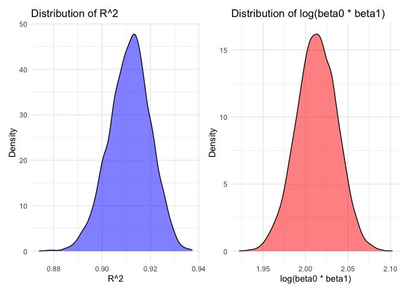

p8105_hw6_fl2715
================
Fengwei Lei

## Load Library and Set Seed

``` r
library(tidyverse)
library(p8105.datasets)
library(patchwork)
library(forcats)
library(modelr)
library(mgcv)
set.seed(1)
theme_set(theme_minimal() + theme(legend.position = "bottom"))
```

## Problem 1

First， we load the data.

``` r
weather_df = 
  rnoaa::meteo_pull_monitors(
    c("USW00094728"),
    var = c("PRCP", "TMIN", "TMAX"), 
    date_min = "2017-01-01",
    date_max = "2017-12-31")  |> 
  mutate(
    name = recode(id, USW00094728 = "CentralPark_NY"),
    tmin = tmin / 10,
    tmax = tmax / 10)  |> 
  select(name, id, everything())
```

After that, we take Bootstrap procedure with `modelr::bootstrap`.

``` r
boot_results = weather_df  |> 
  modelr::bootstrap(n = 5000)  |> 
  mutate(
    model = map(strap, \(df) lm(tmax ~ tmin, data = df)),  
    glance_results = map(model, broom::glance),           
    tidy_results = map(model, broom::tidy)                
  )


final_results = boot_results |> 
  mutate(
    r_squared = map_dbl(glance_results, "r.squared"),  
    tidy_df = map(tidy_results, \(df) df |> 
                    select(term, estimate) |>         
                    pivot_wider(names_from = term, values_from = estimate) |> 
                    mutate(log_beta = log(`(Intercept)`) + log(tmin))) 
  ) |> 
  select(-strap, -model, -glance_results, -tidy_results) |> 
  unnest(tidy_df)  
```

Then, using the results for bootstrap, we draw the distribution plots
for the estimates $`\hat{r}^2`$ and
$`log(\hat{\beta}_0 * \hat{\beta}_1)`$.

``` r
p1 = ggplot(final_results, aes(x = r_squared)) +
  geom_density(fill = "blue", alpha = 0.5) +
  labs(title = "Distribution of R^2", x = "R^2", y = "Density") +
  theme_minimal()

p2 = ggplot(final_results, aes(x = log_beta)) +
  geom_density(fill = "red", alpha = 0.5) +
  labs(title = "Distribution of log(beta0 * beta1)", x = "log(beta0 * beta1)", y = "Density") +
  theme_minimal()

p1 + p2
```

<!-- -->

**Description**:

From the above plots, we can see that these two estimates both nearly
follow the normal distribution. The left plot shows the distribution of
$`\hat{r}^2`$ , concentrated between 0.88 and 0.94 with a symmetric
unimodal shape. The right plot represents
$`log(\hat{\beta}_0 * \hat{\beta}_1)`$ , concentrated between 1.95 and
2.10, also symmetric and unimodal, reflecting precise and stable
estimates.

Using the 5000 bootstrap estimates, identify the 2.5% and 97.5%
quantiles to provide a 95% confidence interval for $`\hat{r}^2`$ and
$`log(\hat{\beta}_0 * \hat{\beta}_1)`$.

``` r
ci_results = final_results |> 
  reframe(
    r_squared_ci = quantile(r_squared, c(0.025, 0.975)),
    log_beta_ci = quantile(log_beta, c(0.025, 0.975))
  )

cat("95% Confidence Interval for R^2:", ci_results$r_squared_ci, "\n")
```

    ## 95% Confidence Interval for R^2: 0.8936684 0.927106

``` r
cat("95% Confidence Interval for log(beta0 * beta1):", ci_results$log_beta_ci, "\n")
```

    ## 95% Confidence Interval for log(beta0 * beta1): 1.964949 2.058887
